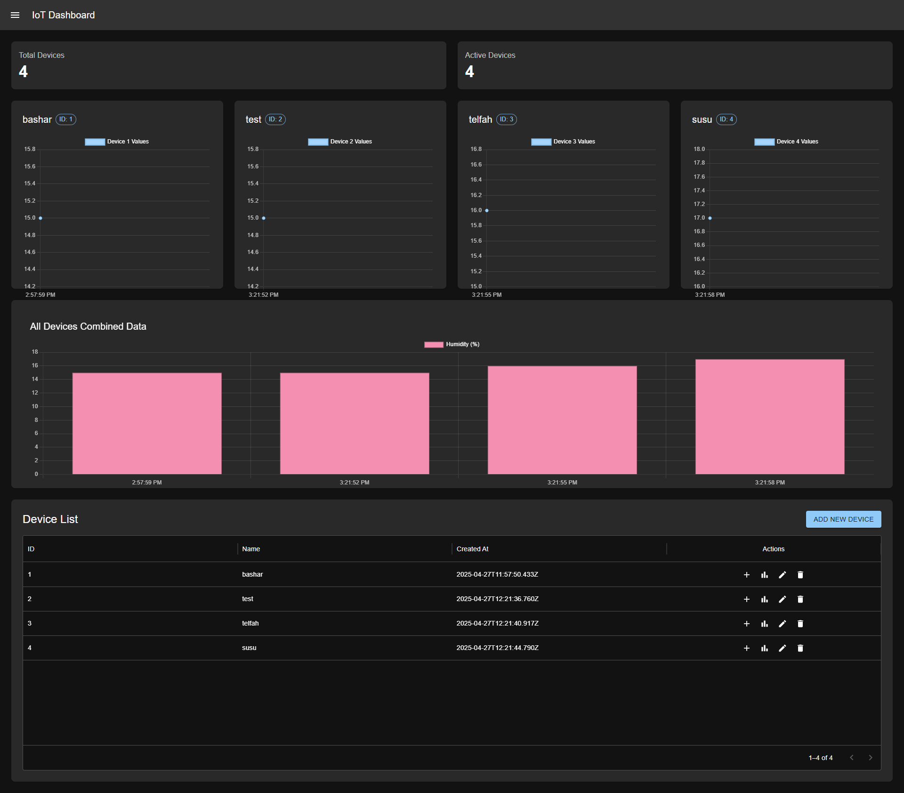

# IoT Device Dashboard



A modern web application for monitoring and managing IoT devices with time-series data visualization.

## Features

- **Device Management**
  - Add new IoT devices
  - View all devices in an interactive table
- **Data Visualization**
  - Real-time charts for each device
  - Combined data overview
  - Responsive design for all screen sizes
- **Data Management**
  - Add new sensor values to devices
  - View historical data trends
- **Dark/Light Theme**
  - Automatic dark mode support
  - Consistent UI styling

## Technologies Used

- **Frontend**
  - React with TypeScript
  - Material-UI (MUI) for UI components
  - Chart.js for data visualization
  - React Query for data fetching
- **Backend**
  - Node.js with Express
  - PostgreSQL for data storage
  - RESTful API design
- **DevOps**
  - Docker for containerization
  - Docker Compose for service orchestration

## Prerequisites

- Node.js (v16+)
- Docker
- PostgreSQL (if not using Docker)

## Installation
- docker-compose up --build

### With Docker (Recommended)

1. Clone the repository:
   ```bash
   git clone https://github.com/BasharST99/iot-dashboard.git
   cd iot-dashboard